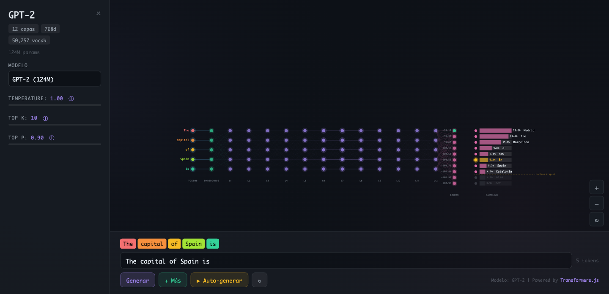

# LLM Pipeline Visualizer

Interactive visualizer that shows step by step how a Large Language Model (GPT-2) processes text and generates the next word. Everything runs directly in the browser, no server required.

**[Live Demo](https://mahiler1909.github.io/llm-pipeline-visualizer/)**



## What it does

You type a prompt, the model processes it, and you see each pipeline stage in real time:

**Text → Tokens → Embeddings → Transformer (12 layers) → Logits → Sampling → Next token**

Each stage is rendered as an interactive network on Canvas with animations, zoom/pan, and educational tooltips.

## Features

- **Full pipeline visualization** — Animated network with nodes for each token, layer, and prediction
- **Real in-browser inference** — GPT-2 running via Transformers.js (ONNX), not a simulation
- **Real embeddings** — Each embedding node shows the actual `wte` row of GPT-2, fetched on demand from the original safetensors via HTTP Range requests (~3KB per token)
- **Real layer-0 attention** — Click a transformer layer to see the block internals (LayerNorm → MHA → FFN → residuals) and the real attention matrix per head, computed in JS from the original weights; hovering a token draws its attention arcs on the canvas
- **Cosine similarity matrix** — Compare the embeddings of all prompt tokens against each other
- **Live sampling distribution** — Sidebar chart that morphs in real time as you move temperature/top-k/top-p, with the top-k cut and the top-p nucleus marked; greedy decoding toggle
- **4 available models** — DistilGPT-2 (82M), GPT-2 (124M), GPT-2 Medium (355M), GPT-2 Large (774M)
- **Autoregressive generation** — "Auto-generate" button that runs multiple steps with token travel animation
- **Educational panel** — Hover over each zone for a two-level explanation (Básico / Profundizar, with the actual formulas) plus a suggested hands-on experiment
- **Collapsible sidebar** — Side panel with model info and configuration

## How to use

No installation, build step, or local dependencies needed. Just a static server:

```bash
# Option 1: Python
python3 -m http.server 8080

# Option 2: Node
npx serve .

# Option 3: VS Code
# Install the "Live Server" extension and click "Go Live"
```

Open `http://localhost:8080` in your browser.

> The first load downloads the model (~500MB for GPT-2). It's cached in the browser for subsequent visits.

## Stack

| | Technology |
|---|---|
| Frontend | Vanilla JavaScript (ES modules) |
| Inference | [Transformers.js](https://huggingface.co/docs/transformers.js) v3 |
| Models | GPT-2 family ([onnx-community](https://huggingface.co/onnx-community)) |
| Visualization | Canvas 2D |
| Styles | Modular CSS (no preprocessor) |
| Build | None |

## Structure

```
├── index.html            # Single page
├── js/
│   ├── app.js            # Main orchestrator
│   ├── pipeline.js       # Tokenize → infer → sample (+ live distribution)
│   ├── models.js         # Model loading via Transformers.js
│   ├── weights.js        # Real weights via Range requests over safetensors
│   ├── attention.js      # Real layer-0 attention computed in JS
│   ├── sampling-panel.js # Animated softmax distribution panel
│   ├── viz.js            # Canvas visualization engine
│   ├── config.js         # Reactive state (pub/sub)
│   └── utils.js          # Utilities (softmax, cosine similarity, colors)
├── css/                  # One CSS file per component
└── assets/               # Favicon
```

## Supported models

| Model | Parameters | Layers | Dimension | Type |
|-------|-----------|--------|-----------|------|
| DistilGPT-2 | 82M | 6 | 768 | fp32 |
| GPT-2 | 124M | 12 | 768 | fp32 |
| GPT-2 Medium | 355M | 24 | 1024 | q8 |
| GPT-2 Large | 774M | 36 | 1280 | q8 |

## Browser requirements

- Recent Chrome, Firefox, or Safari
- WebAssembly enabled
- ~500MB of storage for model cache

## License

Educational project. Models courtesy of [Hugging Face](https://huggingface.co) and [onnx-community](https://huggingface.co/onnx-community).
